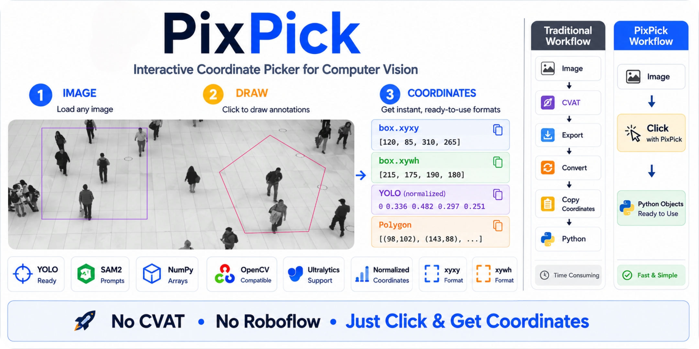

# PixPick

**Draw on the frame. Get the coordinates back in Python.**

Boxes, polygons, lines and points — picked interactively, returned as objects that drop straight into YOLO, SAM and Supervision.




---
## Why PixPick?

Every CV pipeline starts with coordinates you don't have yet.

```python
# YOLO
counter = RegionCounter(region=[(120, 80), (640, 80), (640, 480), (120, 480)])   # where do these come from?

# SAM2 / SAM3
masks = predictor.predict(box=np.array([120, 80, 640, 480]))                     # same question
```

So you do one of three things:

- **Guess and rerun.** Type some numbers, run, squint at the output, nudge, run again.
- **Write the throwaway script.** `cv2.setMouseCallback`, `print(x, y)`, copy from the terminal, paste into the real code, delete the script. Next project — write it again.
- **Open an annotation tool** just to read pixel values off the cursor.

None of that is the work. It's the step everyone hates and nobody automated.

PixPick is that step, done once:

```python
import pixpick

region = pixpick.box("video.mp4", frame=10)  # drag a box on a specific video frame
zone   = pixpick.polygon("image.jpg")        # click polygon vertices
picks  = pixpick.point("image.jpg")          # click foreground / background points
```

A window opens on your image or video frame. You draw. The coordinates come back as Python objects, already in the shape each framework wants. No terminal copy-paste, no throwaway scripts.

---

## Install

```bash
pip install pixpick
```

---

## Selectors

| Selector | How to use | Returns |
|---|---|---|
| `pixpick.box()` | Left-click + drag | `Box` |
| `pixpick.polygon()` | Click vertices | `Polygon` |
| `pixpick.line()` | Click start → click end | `Line` |
| `pixpick.point()` | Click points (fg / bg) | `Point` |

Draw several and you get the matching wrapper instead — `Multibox`, `MultiPolygon`, `MultiLine` or `MultiPoint`.

For more information on controls, see [Getting Started](getting-started.md).

---

## Output formats

Every selection object carries all the formats you'll ever need.

```python
# ── Box ──────────────────────────────────────────────────────
region = pixpick.box("frame.jpg")

region.yolo_region       # coordinates in YOLO region format
region.yolo_prompt       # coordinates in YOLOE visual prompt format
region.sam               # coordinates in SAM box prompt format
region.center            # center point of the box (cx, cy)
region.area              # area of the box in pixels²


# ── Polygon ───────────────────────────────────────────────────
zone = pixpick.polygon("frame.jpg")

zone.supervision         # {"polygon": np.array} — unpack into sv.PolygonZone()
zone.yolo_region         # coordinates in YOLO region format
zone.bbox                # [x1, y1, x2, y2] tight bounds around the polygon
zone.npoints             # int
zone.norm                # normalized coordinates [(x0n,y0n), ...]  0.0 – 1.0


# ── Line ─────────────────────────────────────────────────────
line = pixpick.line("frame.jpg")

line.center               # center point of the line (cx, cy)
line.length               # length of the line in pixels
line.start                # start point of the line (x1, y1)
line.end                  # end point of the line (x2, y2)
line.vertical             # the same line re-drawn vertically   [(x,y), (x,y)]
line.horizontal           # the same line re-drawn horizontally [(x,y), (x,y)]


# ── Point ────────────────────────────────────────────────────
picks = pixpick.point("frame.jpg")

picks.sam                 # {"point_coords": ..., "point_labels": ...} for SAM
picks.xy                  # [(x0,y0), (x1,y1), ...]
picks.labels              # [1, 0, ...]  1 = foreground, 0 = background
picks.bbox                # Box — tight box around every point (only for MultiPoint)
picks.centroid            # (cx, cy) — (only for MultiPoint)
```
For more details, see [Selectors](selectors.md).

---

## Framework integration

| Framework | Selector | Method |
|---|---|---|
| Ultralytics YOLOE — visual prompt | `Box` | `region.yolo_prompt` |
| Ultralytics YOLO — region | `Box`/`Polygon` | `region.yolo_region` |
| SAM / SAM2 / SAM3 — box prompt | `Box` | `region.sam` |
| SAM / SAM2 / SAM3 — point prompt | `Point` / `MultiPoint` | `picks.sam` |
| Supervision PolygonZone — polygon | `Polygon` | `zone.supervision` |
| Supervision KeyPoints — points | `Point` / `MultiPoint` | `picks.supervision` |
| Any other format | any type | `.raw` |